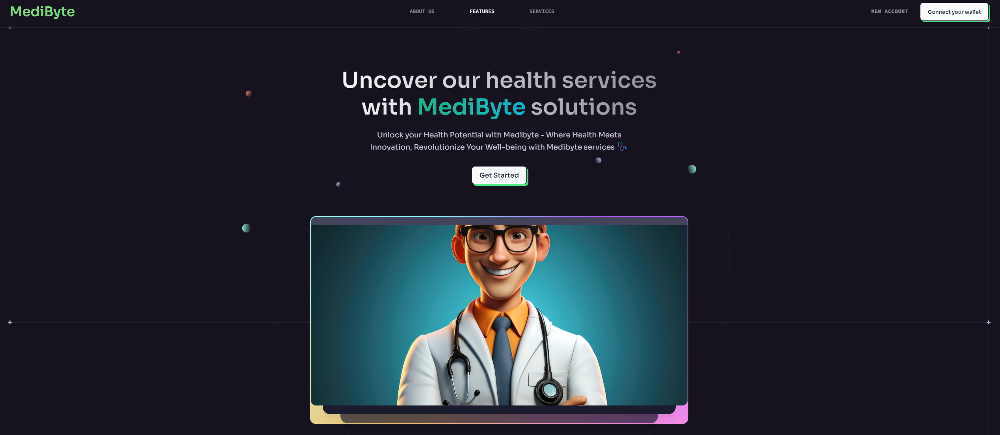
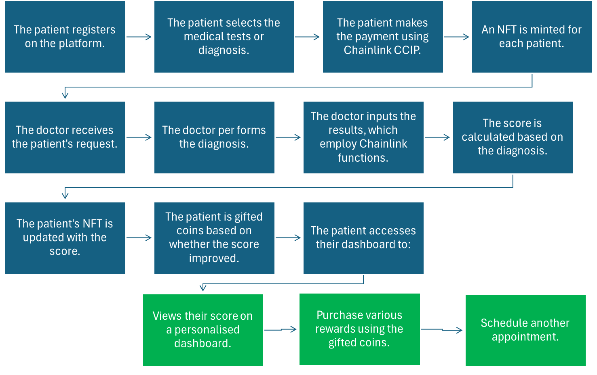

Medibyte 

*Unlock your health potential with Medibyte - where health meets innovation, revolutionise your well-being with Medibyte services* 🩺

Medibyte is a project that leverages the power of the Avalanche smart contract platform to reward users with onchain tokens that link to a unique dynamic NFT. The project attempts to promote healthy living choices by rewarding users with Medicoin tokens (transferable to USDC tokens) according to data held offchain health-related data. 

The project is accessible to users across the globe and ensures a data intensive process like searching and maintaining health records, a very easy task with its friendly user interface. You can see it live here: https://

*You should be met with a homepage that looks like this:*

**The project consists of the following repository:**
https://github.com/TeamMaverick5/Medibyte

**Motivation behind the project**

The motivation for Medibyte stems from a critical need in the healthcare industry: encouraging patients to actively engage in improving and maintaining their health. Typically, patients undergo medical tests and treatments without any immediate or tangible incentives to follow through on health recommendations or track their progress over time.
Medibyte aims to address this gap by leveraging blockchain technology to create a reward system that provides patients with health tokens based on their test results and health improvements. These tokens act as tangible incentives for patients to follow medical advice and make healthier lifestyle choices.

The primary goals of Medibyte are:

1.Incentivize Health Improvements: By rewarding patients with tokens and dynamic NFTs that reflect their health progress, Medibyte motivates patients to stay engaged with their health management and strive for continuous improvement.

2.Enhance Patient Engagement: The reward system fosters a more interactive and engaging experience for patients, encouraging them to regularly participate in health check-ups and follow through on treatments.

3.Strengthen Patient-Provider Relationships: Healthcare providers can use Medibyte to build stronger relationships with their patients, enhancing patient loyalty and satisfaction through a system that recognizes and rewards their efforts.

Medibyte envisions a healthcare ecosystem where patients are more proactive about their health, leading to better health outcomes and a more efficient healthcare system overall.

**How it works**

Medibyte is a web3-based health incentive platform that integrates blockchain technology to reward patients for health improvements. The platform consists of several components: smart contracts, IPFS for data storage, Chainlink services, and a frontend built with modern web technologies. Here’s a detailed breakdown of the architecture and how each part works together:

1. Patient Selects Tests and Pays
   
Payment Options
->On the Same Chain: If the patient and doctor are on the same chain (e.g., Avalanche), the patient pays for the tests   
  directly to the Health_Contract using USDC.
->Cross-Chain via CCIP: If the patient is on a different chain, they can still pay using USDC via Chainlink's Cross-Chain 
  Interoperability Protocol (CCIP). This involves transferring data along with the tokens, where the data includes a 
  function selector and its arguments.
Function: selectTests
->The patient calls the selectTests function in the Health_Contract, passing the selected tests and payment amount.
->The contract stores the test selections in a mapping and logs the patient's details.

2. Doctor Uploads Test Results

Data Storage on IPFS:
->The doctor performs the tests and uploads the results to IPFS, ensuring the data is decentralized and securely stored.
Function: updatePatientHealthScore
->The doctor then calls updatePatientHealthScore in the Health_Contract. This function sends a request to Chainlink's Off- 
  Chain Computation (Functions) to process the patient's data.
->The off-chain function retrieves the patient's data from IPFS, calculates the health score, determines the number of 
  health tokens to be awarded, and updates the patient's NFT with a new URI reflecting the updated score.

  

**Backend**

Found here: https://github.com/TeamMaverick5/Medibyte/tree/main/ipfs-api

The backend infrastructure is built with MongoDB and Node.js, noting that data is decentralised via the IPFS gateway. 

An offchain function was also used to save gas. As outlined above, Medibyte uses an offchain function to:
1. calculate the patient score; * 
2. update the corresponding NFT held by a patient;
3. send an updated score alongside other attributes (e.g. number of Medicoins) to the user; and 
4. simultaneously: a) return a URI to the Medibytes team to outline the amount of tokens to be issued to the patient and, b) return the URI of patient nft to the smart contract handling the core logic (Health_Contract).   

The above is made possible because once a patient initially registers, the API sets the NFT data which stores the unique URI where NFT data is stored on IPFS. 

**to calculate a patient score the deployed smart contracts are fetching data from the same API and applying our calculation logic on that data.*

**Frontend**

Found here: https://github.com/TeamMaverick5/Medibyte/tree/main/client

The frontend uses React and  Vite to provide a minimal setup to get React working in Vite with HMR and some ESLint rules. Together, these tools provide users with a minimalist and modern interface for frictionless interaction with the backend.

To also ensure seamless use of the Medibytes platform, the Medibytes team has also integrated Chainlink’s Cross-Chain Interoperability Protocol (CCIP) for patients to use other networks. This is made possible by the use of a receiver and sender contracts. Put simply, the receiver contract is deployed on the doctor's network and sender contract is deployed on the patient's network. What this practically means is that patients are able to easily pay for medical tests in USDC from their respective network or better yet, receive rewards directly to their connected wallet.  

**Summary**

When using Medibyte, health records are stored via offchain services and subsequently decentralised via the IPFS gateway to ensure the data is both immutable and secure. This evidences the ability for health records to be truly owned and easily accessed by individuals to yield a net positive to society. This project also demonstrates the potential to reward users via tokens linked to real world outcomes. Changing and storing medical data is very easy, provided health professionals will enter the data on a client's behalf and it is displayed in real time to the client. This means all the user has to do is log on, look at the records and focus on building a healthier lifestyle. Our features tab has a limited list of services you can see for yourself. 

**Challenges we ran into**

Aside from the conceptual design of the project, we also ran into the logistical issue of communicating from different time difference. Another challenge was the actual encryption of user data. Initially we had a centralised database that we were unsure how to integrate into the Web3 space but ultimately resolved this by looking to the IPFS gateway. 

**Accomplishments**

We are proud of finishing the project on time which seemed almost unlikely due to some bugs we ran into across our journey. 

But overall, we are incredibly proud of Medibyte due to its potential to bring efficiencies into the healthcare industry. The collaborative effort, overcoming technical challenges, and delivering a functional product within a limited time frame showcased our team's dedication, technical skills, and creativity. This accomplishment not only reflects our budding passion but also our commitment to creating impactful technology, especially at our level of experience in using Web3 technology.

**What we learnt**

In terms of technical skills, we deepened our understanding of Solidity for writing secure and efficient smart contracts. We also made sure to learn more about Chainlink CCIP. Specifically, we learnt how to use Chainlink’s CCIP to facilitate secure payments and interactions across different blockchain networks. We also learnt about the benefits of decentralised storage by gaining practical experience with the IPFS for decentralised storage, ensuring data integrity and accessibility in a distributed environment.

At a minimum, we enhanced our ability to ask intelligent questions to the Chainlink dev team and utilised Stack Overflow when running into technical issues during the hackathon. We also learnt that communication with team members meant deadlines were readily achievable and a seemingly impossible task became manageable with teamwork.

